% Omavalvonta, ylläpitäjän opas
% Sami Hostikka
% 21.05.2013

\renewcommand{\contentsname}{Sisällys}
\tableofcontents
\newpage

# Ylläpito

Omavalvonnan ylläpitosivuilla on mahdollista lisätä ja muokata:

- Uutisia
- Termejä
    - Raaka-aineen tuottaja
    - Erän kohtalo myyntihyväksynnässä
    - Mittayksikkö
    - Muutoksen syy
- Raaka-aineita
- Tuotteita
- Lomakkeita
- Kenttäryhmiä

Käyttäjän pääsy ylläpitosivulle perustuu käyttäjän rooliin, joka on määritetty Shibbolethin käyttämässä käyttäjähakemistossa.

\newpage

## Miten ylläpitosivulle pääsee?

1. Mikäli et ole kirjautuneena omavalvonnassa, kirjaudu siihen painamalla **Kirjaudu** nappia.

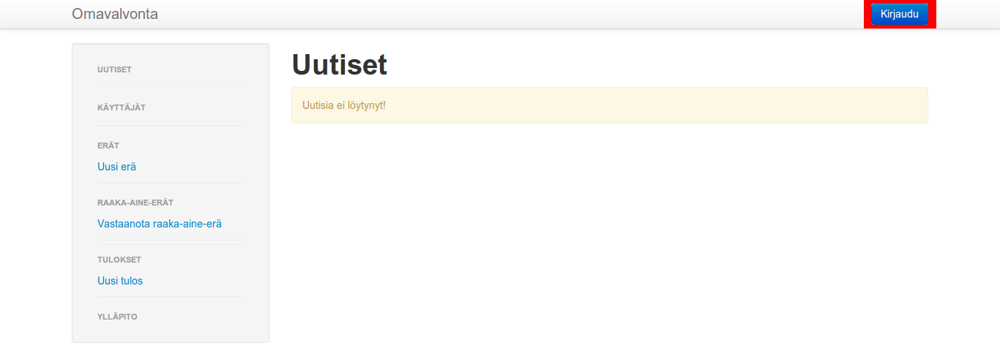

2. Klikkaa vasemmassa navigaatiopalkissa **Ylläpito** linkkiä

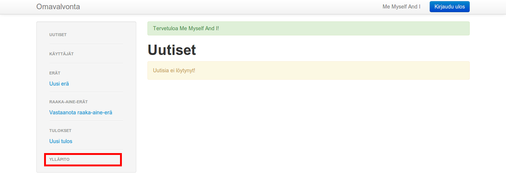

\newpage

## Miten ylläpitosivulta pääsee pois?

1. Klikkaa **Omavalvonta Ylläpito** linkkiä tai **Kirjaudu ulos** nappia

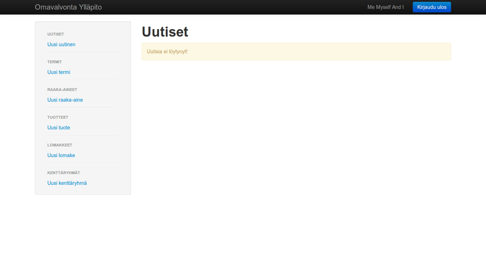

\newpage

# Uutiset

Uutiset ovat tiedotteita, jotka näkyvät käyttäjille omavalvonnan etusivulla.

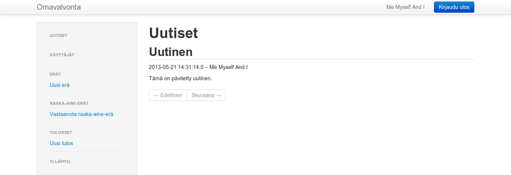

\newpage

## Lisääminen

1. Klikkaa vasemmassa navigaatiopalkissa **Uusi uutinen** linkkiä

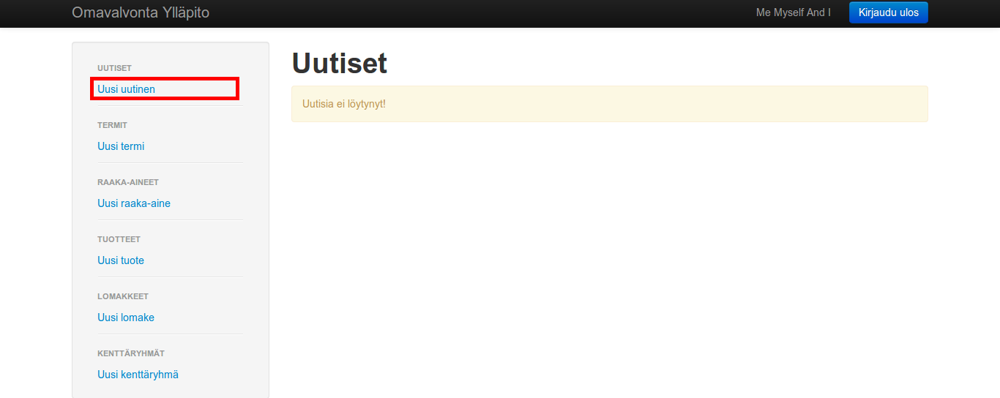

2. Kirjoita uutiselle otsikko **Nimi** kenttään ja uutinen **Uutinen** kenttään
    - *Huomaa:* voit muuttaa uutiskentän kokoa tarttumalla kentän oikeaan alalaitaan

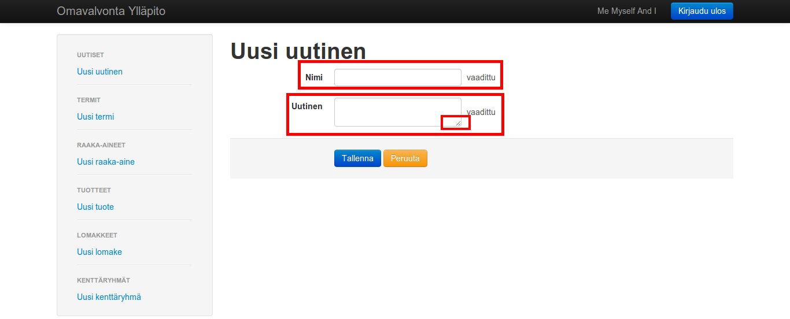

\newpage

3. Klikkaa **Tallenna** nappia

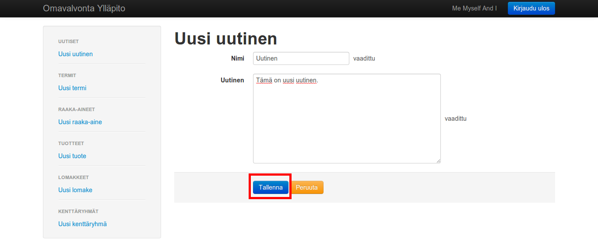

\newpage

## Muokkaaminen

1. Klikkaa vasemmassa navigaatiopalkissa **Uutiset** linkkiä

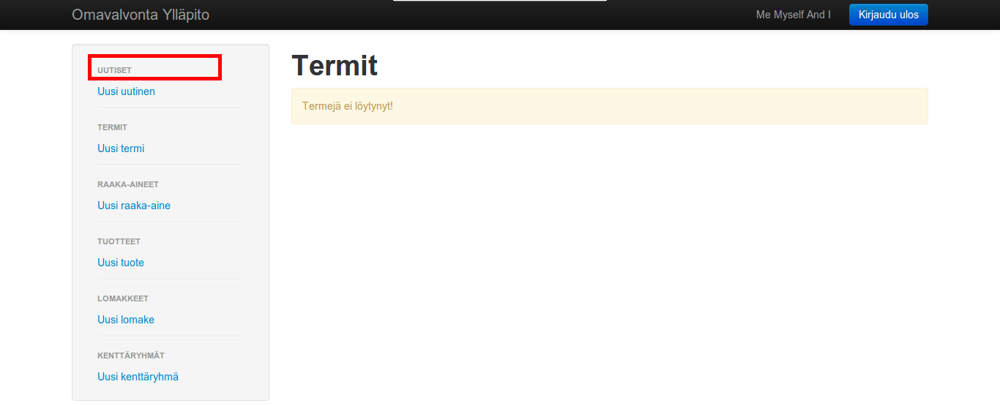

2. Valitse listasta muokattava uutinen, klikkaa sen **päivämäärää**

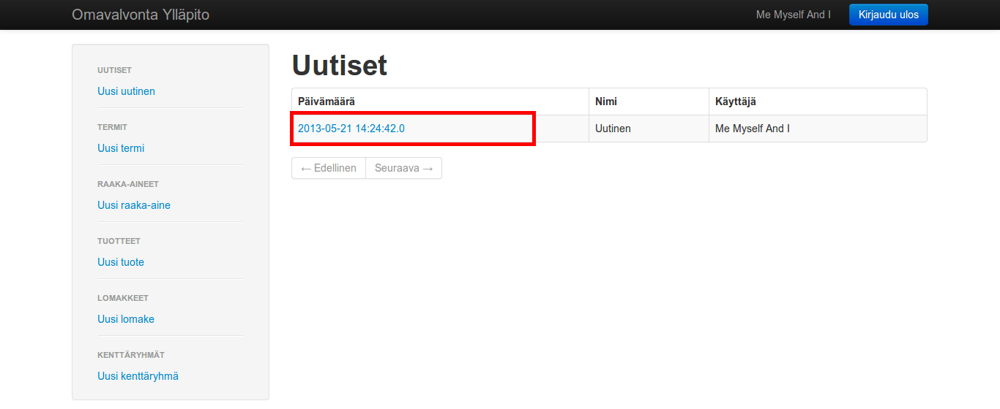

\newpage

3. Tee uutiseen tarvittavat muutokset, paina sen jälkeen **Tallenna** nappia

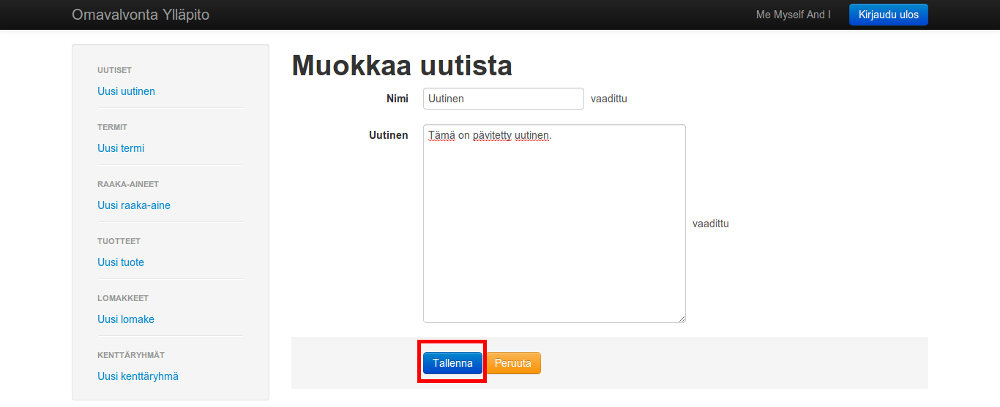

\newpage

# Termit

Termit on huono käsite kuvaamaan mihin termejä käytetään. Termit ovat omavalvonnassa käytettäviä määritelmiä, jotka muodostuvat yhdestä sanasta. Määritelmät on niputettu termeiksi yksinkertaisuuden vuoksi. Termit ovat määritelmiä, joita on mahdollista lisätä tai muuttaa. Termeinä määritetään:

- Raaka-aineineden mittayksiköt, jolloin kategoriana on **Mittayksikkö**
    - Esimerksiksi kilo tai litra
    - Käytetään raaka-aineiden vastaanotossa, tuote-erien luonnissa sekä lopputuotteiden punnituksessa
- Raaka-aine-erän tuottaja, jolloin kategoriana on **Raaka-aineen tuottaja**
    - Esimerkiksi Hämeenlinnan osuusmeijeri
    - Käytetään raaka-aine-erien vastaanotossa
- Mitä lopputuotteelle tapahtuu, jolloin kategoriana on **Erän kohtalo myyntihyväksynnässä**
    - Esimerkiksi myyntiin tai hylätty
    - Käytetään lopputuotteessa, kun määritetään mitä tuote-erälle tapahtuu
- Tuloksen/määrityksen muutoksen syy, jolloin kategoriana on **Muutoksen syy**
    - Esimerkiksi kirjoitusvirhe tai mittavirhe
    - Käytetään, kun tuloksen/määrityksen arvoa muutetaan, niiden muuttaminen ei ole mahdollista ilman syytä

## Lisääminen

1. Klikkaa vasemmassa navigaatiopalkissa **Uusi termi** linkkiä

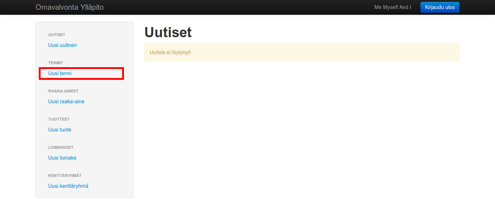

2. Kirjoita termille nimi **Nimi** kenttään ja valitse termin kategoria **Kategoria** alasvetovalikosta

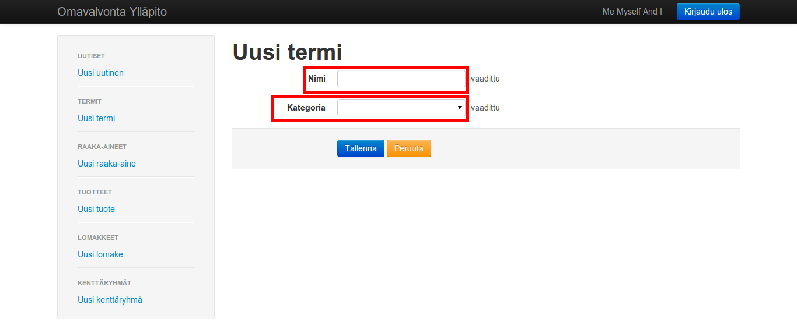

\newpage

3. Klikkaa **Tallenna** nappia

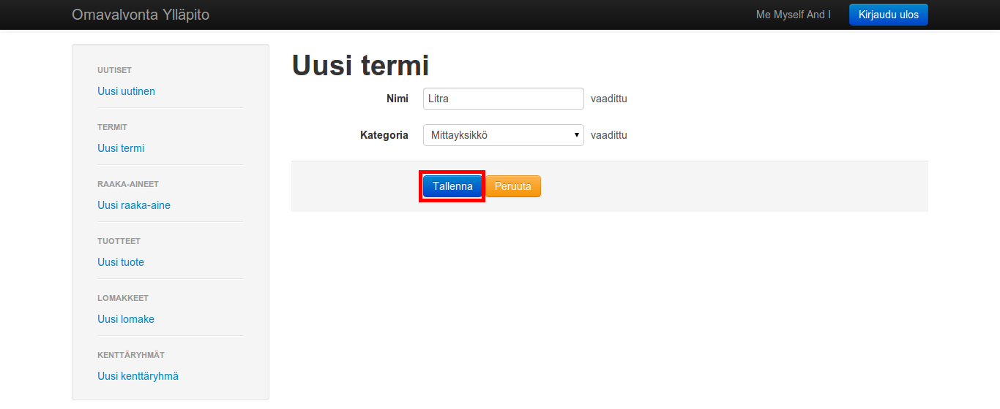

\newpage

## Muokkaaminen

1. Klikkaa vasemmassa navigaatiopalkissa **Termit** linkkiä

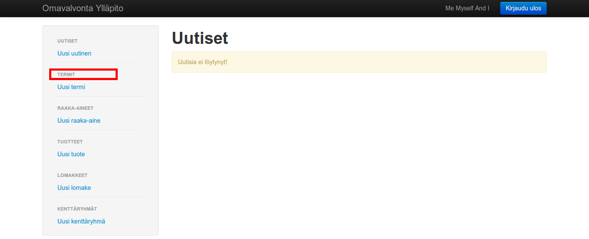

2. Valitse listasta muokattava termi, klikkaa sen **nimeä**

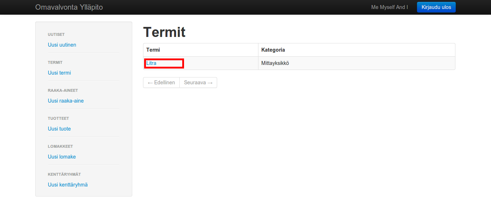

\newpage

3. Tee termin nimeen tarvittavat muutokset, paina sen jälkeen **Tallenna** nappia

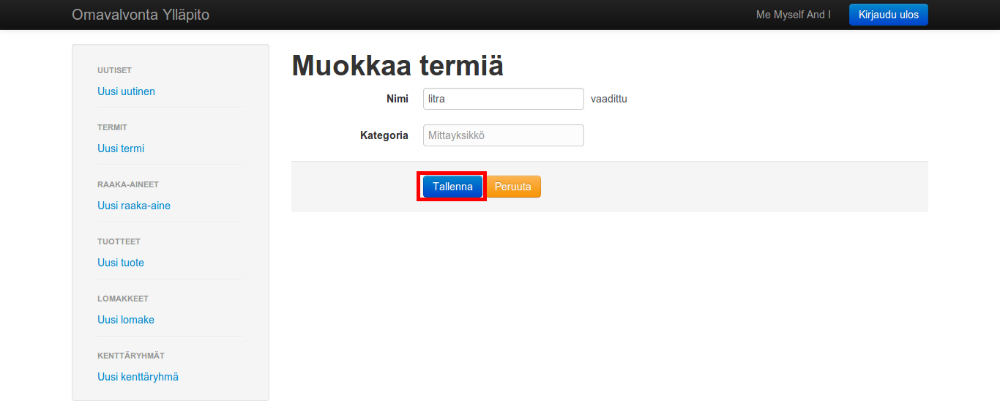

\newpage

# Raaka-aine

## Lisääminen

1. Klikkaa vasemmassa navigaatiopalkissa **Uusi raaka-aine** linkkiä

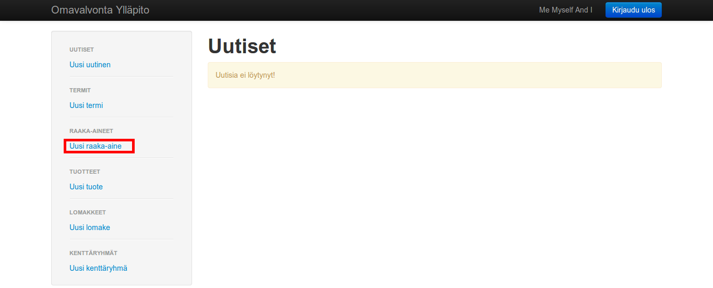

2. Määritä raaka-aineen nimi, säilymisaika päivinä sekä mahdollinen kuvaus
    - *Huomaa:* voit muuttaa kuvauskentän kokoa tarttumalla kentän oikeaan alalaitaan

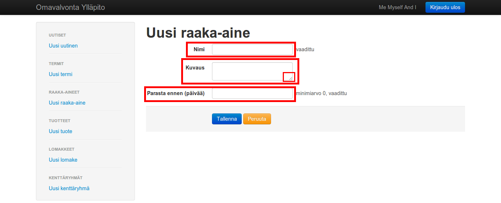

\newpage

3. Klikkaa **Tallenna** nappia

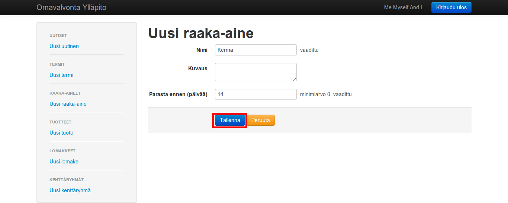

## Muokkaaminen

1. Klikkaa vasemmassa navigaatiopalkissa **Raaka-aineet** linkkiä

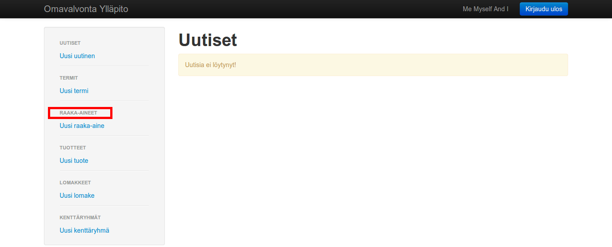

\newpage

2. Valitse listasta muokattava raaka-aine, klikkaa sen **nimeä**

3. Tee raaka-aineeseen tarvittavat muutokset, paina sen jälkeen **Tallenna** nappia

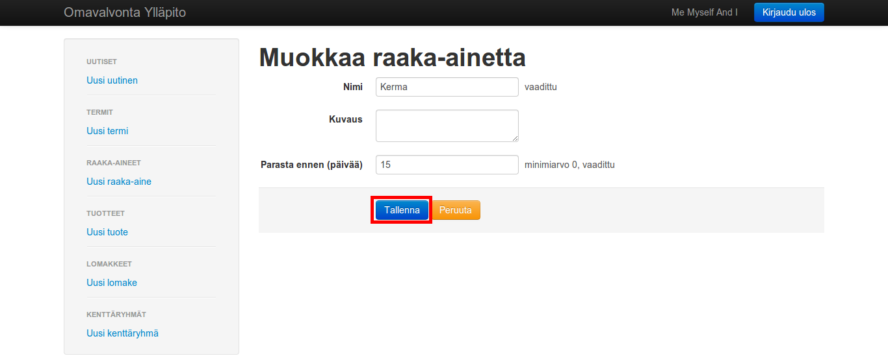

\newpage

# Lomakkeet

Lomakkeet koostuvat kenttäryhmistä eli omavalvonnan termein prosessivaiheista/näytteenottokohteista ja kenttäryhmät koostuvat kentistä eli omavalvonan termein määrityksistä. Oheisessa kuvassa on ote omavalvonnan lomakkeesta, johon on merkitty osaset.

\newpage

## Kenttäryhmät

### Lisääminen

1. Klikkaa vasemmassa navigaatiopalkissa **Uusi kenttäryhmä** linkkiä

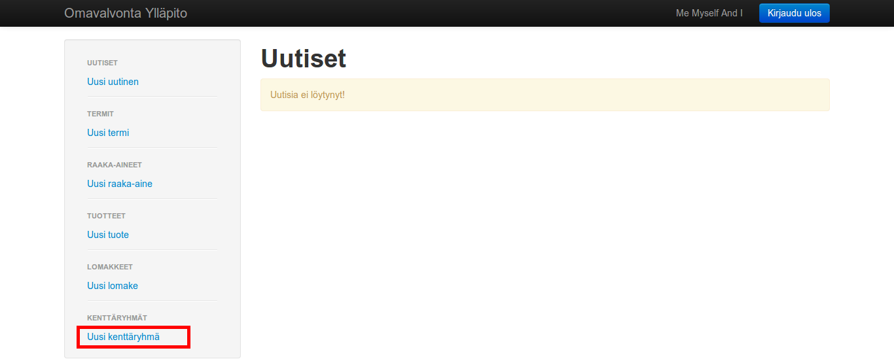

2. Määritä kenttäryhmälle nimi
    - Kenttäryhmän nimi toimii kenttäryhmän alaotsikkona lomakkeessa
    - Kenttäryhmän kuvaus näkyy lomakkeessa alaotsikon alla, se voi olla esimerkiksi ohje
    - *Esimerkiksi* ennen töiden aloittamista

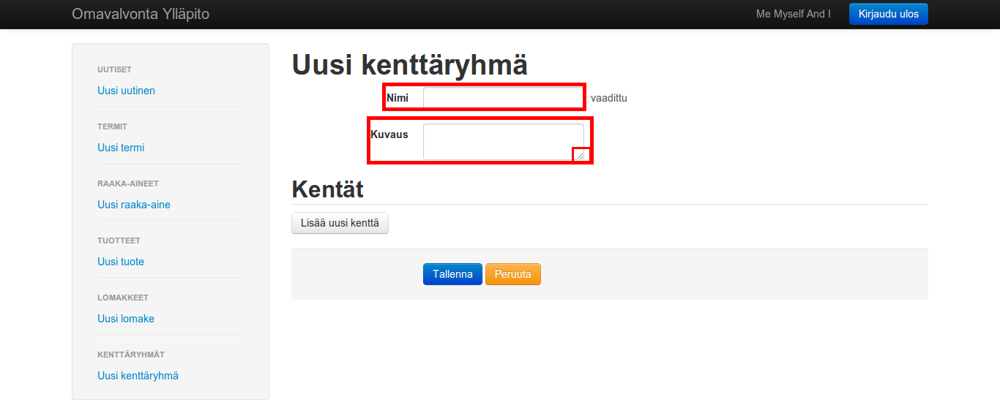

\newpage

3. Kenttäryhmälle lisätään kenttiä **Lisää uusi kenttä** napista

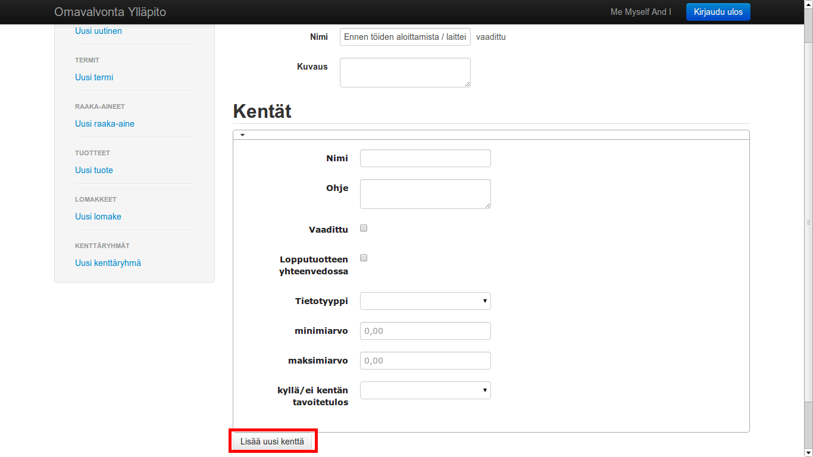

4. Määritetään kenttäryhmän kenttä
    - Kentän nimi tarkoittaa omavalvonnan termistössä määritystä
    - *Esimerkiksi* nimi voi olla visuaalinen puhtaustarkastus
    - Ohje on kenttä, joka näkyy lomakkeessa määrityksen vieressä
    - Vaadittu tarkoittaa sitä, että tulos vaaditaan aina, arvoa käytetään tuloksen oikeallisuuden arvioinnissa
    - Lopputuotteen yhteenvedossa valinta tarkoittaa sitä, että lomakkeen kenttä on tärkeä ja sen tulos näytetään lopputuotteen tuloksien yhteenvedossa
    - Tietotyyppi on määrityksen tyyppi, eli minkälaista tulosta odotetaan
        - Teksti
        - Kyllä / ei
        - Päivämäärä
        - Kokonaisluku
        - Desimaaliluku
    - Minimiarvoa käytetään numeraallisen tuloksen tarkistuksessa, mikäli tulos on pienempi kuin minimiarvo on tulos korostettu punaisella
    - Maksimiarvoa käytetään numeraallisen tuloksen tarkistuksessa, mikäli tulos on suurempi kuin maksimiarvo on tulos korostettu punaisella
    - Kyllä / ei kentän tavoitetulosta käytetään kyllä / ei tyyppisten tulosten tarkistuksessa, mikäli tavoitetulos ei toteudu on tulos korostettu punaisella

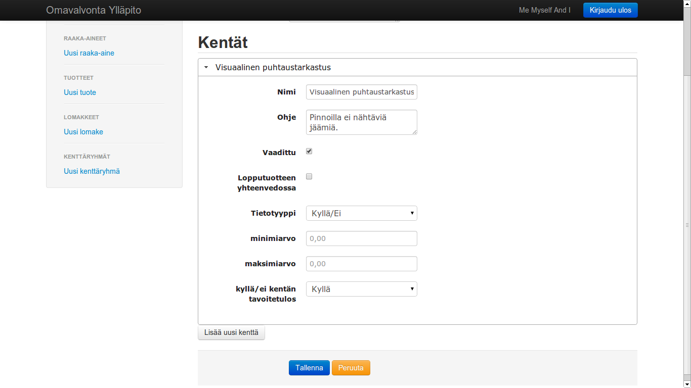

\newpage

5. Toistetaan vaiheet 3-4, kunnes kenttäryhmän kaikki kentät on lisätty

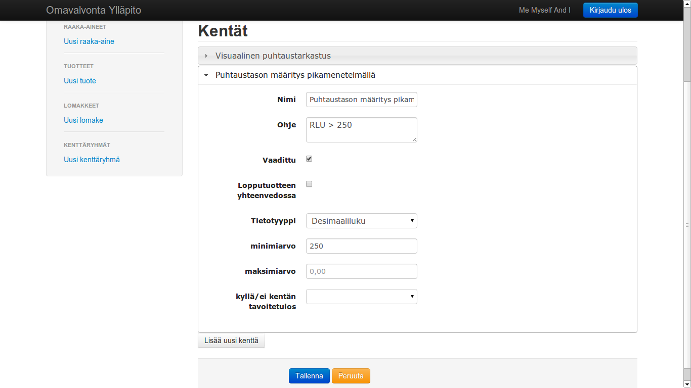

\newpage

6. Kenttäryhmän kenttien järjestystä on mahdollista muuttaa, siten, että kentän otsikkoon tartutaan ja kenttää raahataan oikeaan kohtaan

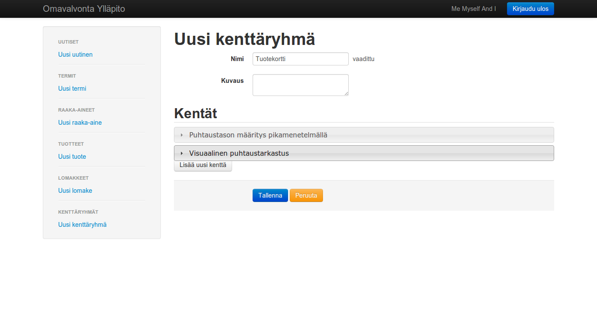

7. Kenttäryhmä tallennetaan **Tallenna** napista

### Kenttäryhmän muokkaaminen

1. Klikkaa vasemmassa navigaatiopalkissa **Kenttäryhmät** linkkiä

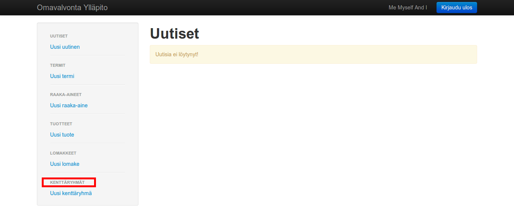

\newpage

2. Klikataan muokattavan kenttäryhmän nimeä

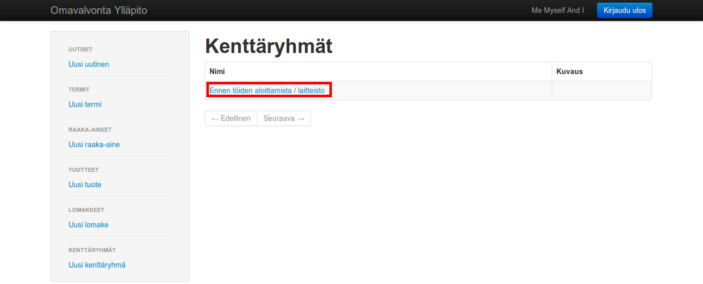

3. Klikataan kenttäryhmän esikatselussa sivun alalaidassa olevaa **Muokkaa kenttäryhmää** nappia

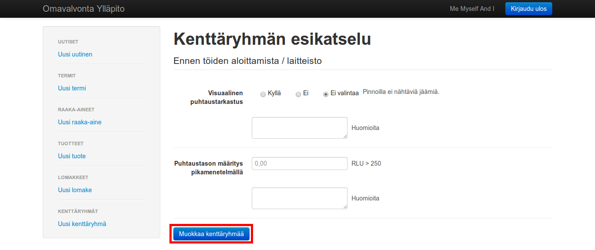

\newpage

4. Tehdään kenttäryhmään tai kenttiin tarvittavat muutokset ja tallennetaan ne painamalla **Tallenna** nappia
    - *Huomaa* voit muokata kenttää, kun klikkaat sen otsikkoa
    - *Huomaa* kenttien järjestystä voi muuttaa, tartu kentän otsikkoon hiirellä ja raahaa kenttä haluttuun kohtaan

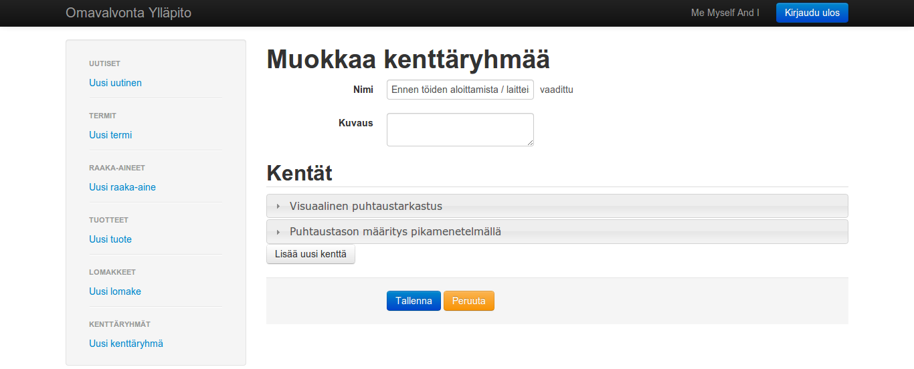

## Lomakkeen lisääminen

1. Klikkaa vasemmassa navigaatiopalkissa **Uusi lomake** linkkiä

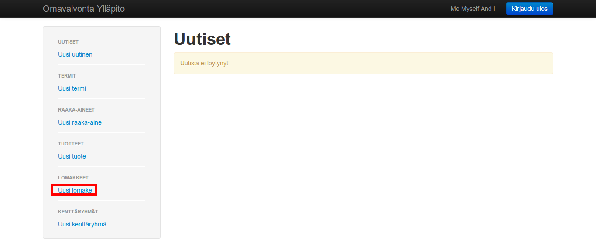

\newpage

2. Määritetään lomake
    - Nimeä käytetään lomakkeen otsikkona
    - Kuvausta käytetään lomakkeen alussa, se voi olla esimerkiksi ohje
    - Ruksitaan kenttäryhmät, joista lomake koostuu

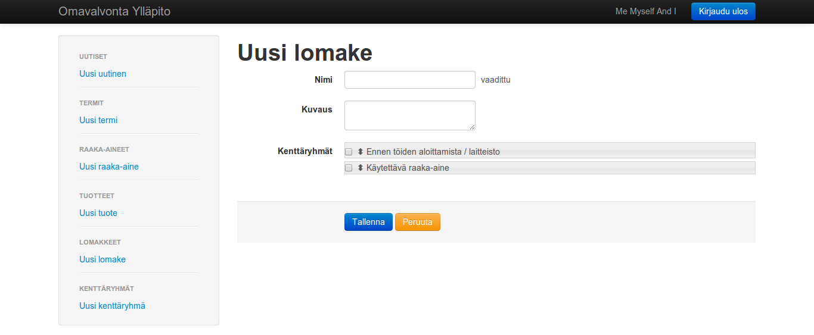

3. Huomaa, kenttäryhmien järjestystä on mahdollista muuttaa, tartu kenttäryhmän nimeen hiirellä ja raahaa se haluttuun kohtaan
    - Kenttäryhmien järjestys määrittää järjestyksen, jossa ne ovat lomakkeissa

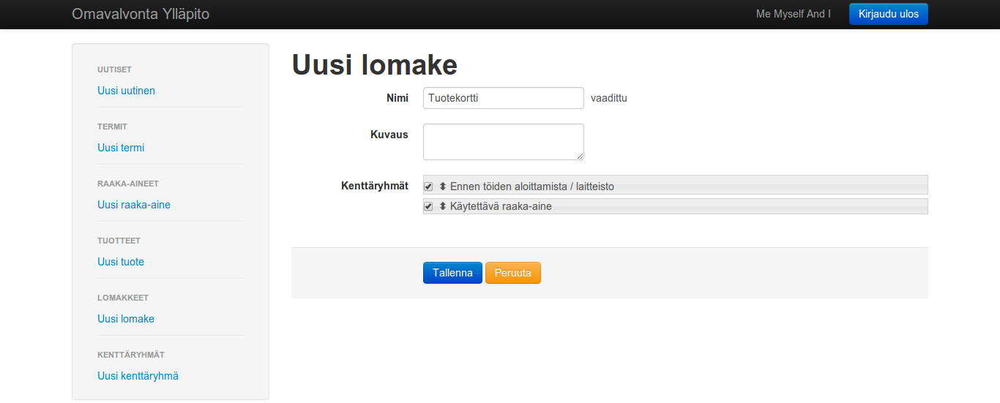

7. Lomake tallennetaan **Tallenna** napista

\newpage

## Lomakkeen muokkaaminen

1. Klikkaa vasemmassa navigaatiopalkissa **Lomakkeet** linkkiä

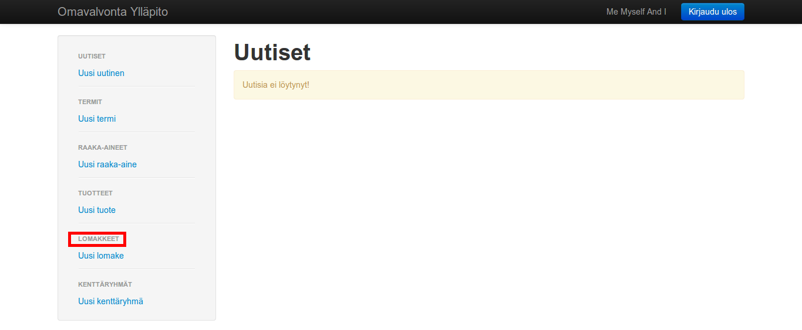

2. Klikataan muokattavan lomakkeen nimeä

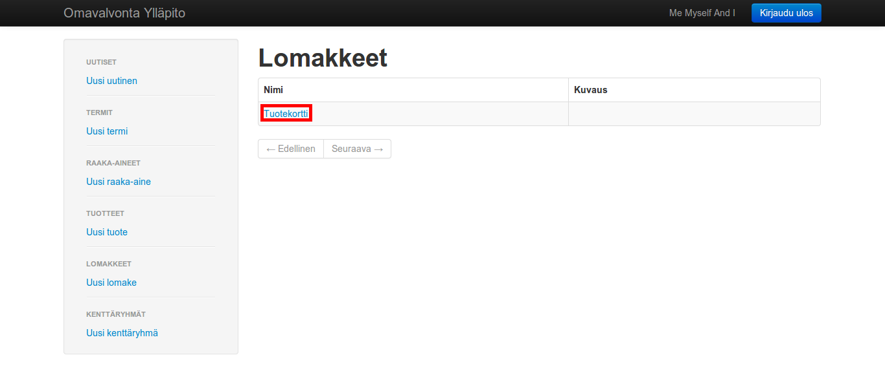

\newpage

3. Klikataan lomakkeen esikatselussa sivun alalaidassa olevaa **Muokkaa lomaketta** nappia

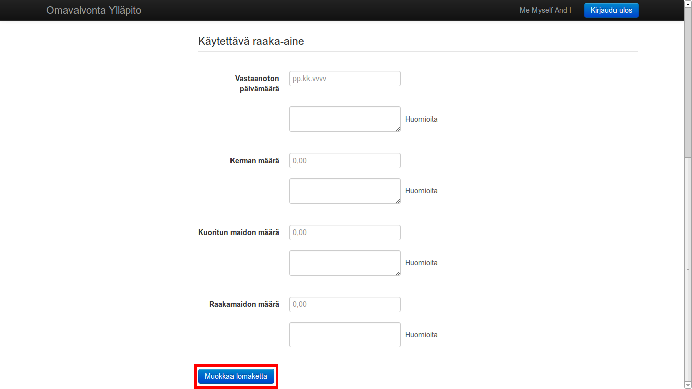

4. Tehdään lomakkeeseen tai kenttäryhmien järjestykseen tarvittavat muutokset ja tallennetaan ne painamalla **Tallenna** nappia
    - Huomaa, kenttäryhmien järjestystä on mahdollista muuttaa

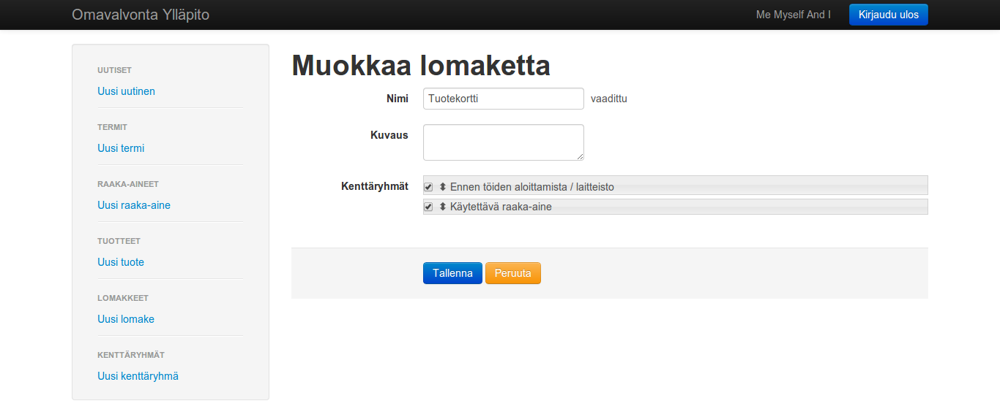

\newpage

# Tuotteet

## Lisääminen

1. Klikkaa vasemmassa navigaatiopalkissa **Uusi tuote** linkkiä

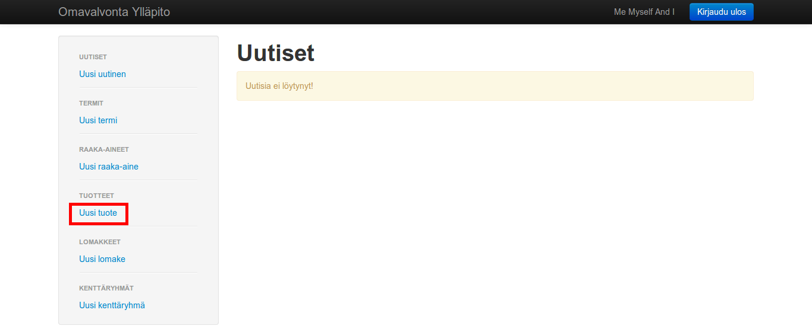

2. Määritetään tuote
    - Tuotenumero on tuotteelle yksilöllinen
    - Nimi on tuotteen nimi, esimerkiksi jäätelö
    - Ruksitaan tuotteen käyttämät raaka-aineet, raaka-aine tietoa käytetään esimerkiksi kun tuote-erää luodaan
    - Ruksitaan tuotteen lomakkeet, valinnat vaikuttavat siihen, mitä tuloksia tuotteelle voidaan syöttää

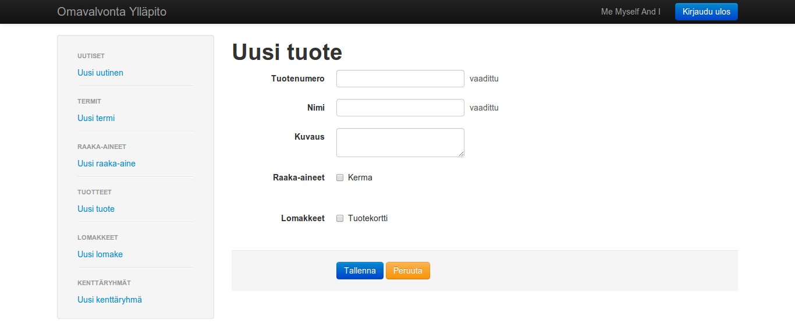

\newpage

3. Tallennetaan tuote painamalla **Tallenna** nappia

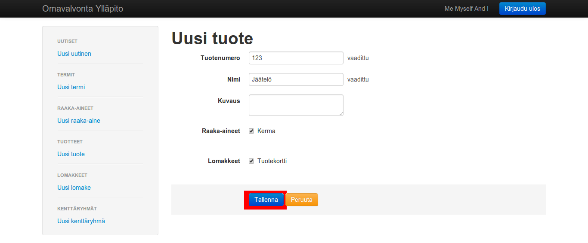

## Muokkaaminen

1. Klikkaa vasemmassa navigaatiopalkissa **Tuotteet** linkkiä

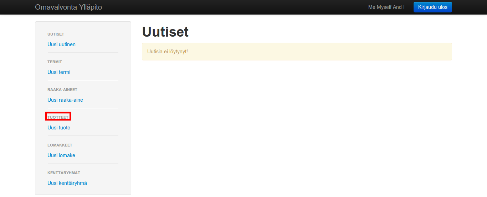

\newpage

2. Klikataan muokattavan tuotteen tuotenumeroa

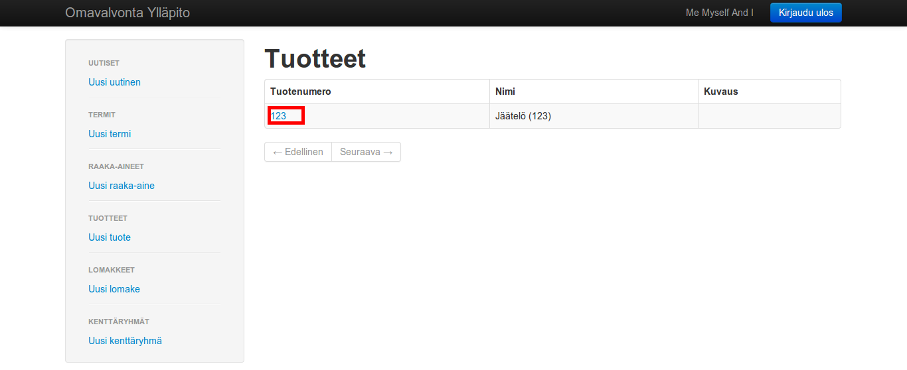

3. Tehdään tuotteeseen tarvittavat muutokset ja tallennetaan ne painamalla **Tallenna** nappia

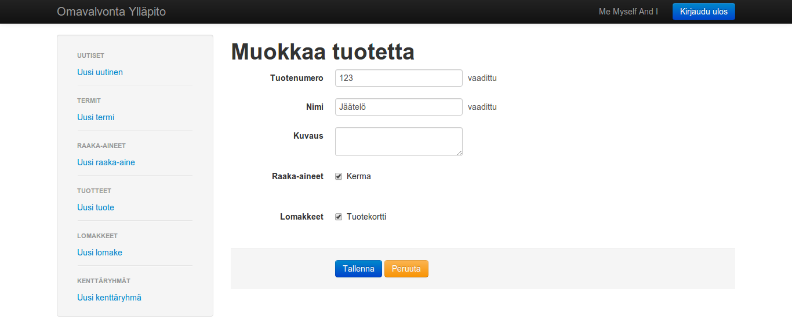
